# shorten-url-frontend

A modern URL shortening and bookmark management web application built with React 19 and TypeScript.

The frontend provides an interface for users to shorten URLs, create and manage bookmarks, manage their profile, and authenticate securely. It communicates with the backend services through REST APIs and uses client-side routing and server-state management for a responsive user experience.

The project is containerized with Docker and includes the supporting infrastructure required to run the application locally, including PostgreSQL, Redis, backend services, and Nginx.

--- 

## Tech Stack

| Category         | Technology                  | Purpose                                                          |
|------------------|-----------------------------|------------------------------------------------------------------|
| Frontend         | React 19                    | Build the user interface                                         |
| Language         | TypeScript                  | Type-safe application development                                |
| Build Tool       | Vite                        | Development server and production build                          |
| Routing          | React Router                | Client-side routing and route protection                         |
| Data Fetching    | TanStack Query              | Server-state management, caching, and mutations                  |
| HTTP Client      | Axios                       | Communication with backend REST APIs                             |
| UI Components    | Syncfusion React Components | Pre-built UI components such as buttons, inputs, and tables      |
| Icons            | Lucide React                | Application icons                                                |
| Styling          | Tailwind CSS                | Utility-first styling                                            |
| CSS Utilities    | tailwind-merge, clsx        | Conditional and merged Tailwind classes                          |
| Containerization | Docker                      | Application and service containerization                         |
| Orchestration    | Docker Compose              | Running frontend, backend, database, and infrastructure services |
| Reverse Proxy    | Nginx                       | Reverse proxy and API routing                                    |
| CI/CD            | GitHub Actions              | Automated build and deployment workflows                         |


--- 

## Install library

| Category      | Library                     | Installation                                                                                                                                                                                                                                                                                                      |
|---------------|-----------------------------|-------------------------------------------------------------------------------------------------------------------------------------------------------------------------------------------------------------------------------------------------------------------------------------------------------------------|
| Syncfusion    | Syncfusion React Components | npm install @syncfusion/ej2-base @syncfusion/ej2-react-buttons @syncfusion/ej2-react-charts @syncfusion/ej2-react-grids @syncfusion/ej2-react-dropdowns @syncfusion/ej2-react-maps @syncfusion/ej2-react-navigations @syncfusion/ej2-react-splitbuttons @syncfusion/ej2-react-charts @syncfusion/ej2-react-inputs |
| Routing       | React Router                | npm install react-router                                                                                                                                                                                                                                                                                          |
| Data Fetching | TanStack Query              | npm install @tanstack/react-query @tanstack/react-query-devtools axios                                                                                                                                                                                                                                            |
| Styling       | Tailwind CSS                | npm install tailwindcss tailwind-merge                                                                                                                                                                                                                                                                            |
| Prettier      | Prettier                    | npm install -D prettier --save-dev prettier                                                                                                                                                                                                                                                                       |
| Lucide Icon   | Lucide React                | npm install lucide-react                                                                                                                                                                                                                                                                                          |
| Utilities     | Day.js, clsx                | npm install dayjs clsx                                                                                                                                                                                                                                                                                            |

---

## Project Structure

```
shorten-url-frontend/
├── .github/workflows/       # CI/CD pipelines
├── bookmark-service/
│   └── .env                 # environment for bookmark-service
├── user-service/
│   └── .env                 # environment for user-service
├── worker-service/
│   └── .env                 # environment for worker-service
├── nginx/
│   └── nginx.conf           # environment for nginx
├── postgres/                # DB initialization scripts
│   ├── init-db/             
│   │   └── 01_init_dbs.sql  # Initialize user and bookmark table
│   └── .env                 # environment for postgres
├── urlshorten/
│   ├── public/assets/       # icon, images for frontend
│   ├── src/
│   │   ├── api/             # API clients & HTTP request configuration
│   │   ├── components/      # Reusable UI components
│   │   ├── constants/       # Application-wide constants & static configuration
│   │   ├── context/         # React Context providers for shared application state
│   │   ├── hooks/           # Custom React hooks & reusable data-fetching logic
│   │   ├── lib/             # Shared utilities & helper functions
│   │   ├── routes/          # Route definitions & page-level components
│   │   ├── index.css/       # Global CSS styles for the entire application
│   │   └── main.tsx/        # Application entry point & global providers setup
│   ├── .prettierrc          
│   ├── package.json         
│   ├── package-lock.json 
│   ├── tsconfig.app.json
│   ├── tsconfig.json
│   ├── tsconfig.node.json
│   └── vite.config.ts  
├── Dockerfile
├── docker-compose.yaml
├── Makefile
├── .dockerignore
└── .gitignore
```

---

## Routes

| Component          | Path                         | Description                           |
|--------------------|------------------------------|---------------------------------------|
| SignIn             | `/sign-in`                   | User sign-in page                     |
| SignUp             | `/sign-up`                   | User registration page                |
| ShortenURL         | `/`                          | URL shortening page                   |
| BookmarksDashboard | `/bookmarks-dashboard`       | Display user's bookmarks              |
| BookmarksCreation  | `/bookmarks-creation`        | Create a new bookmark                 |
| BookmarkRedirect   | `/bookmarks-creation/:code`  | Redirect to a bookmark using its code |

### User sign-in page

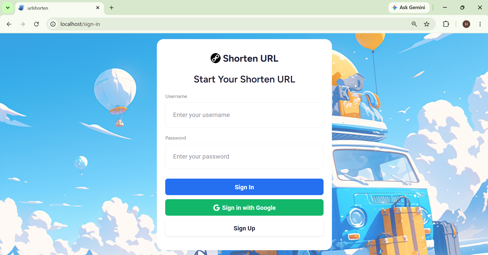

### User registration page

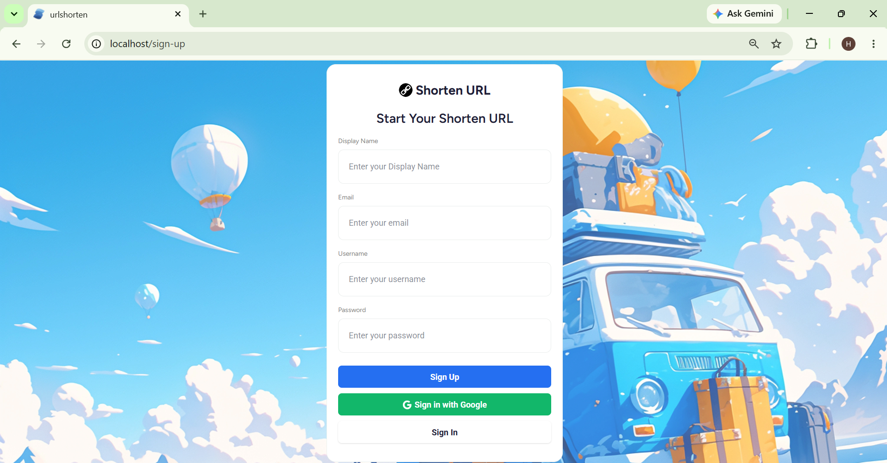

### URL shortening page

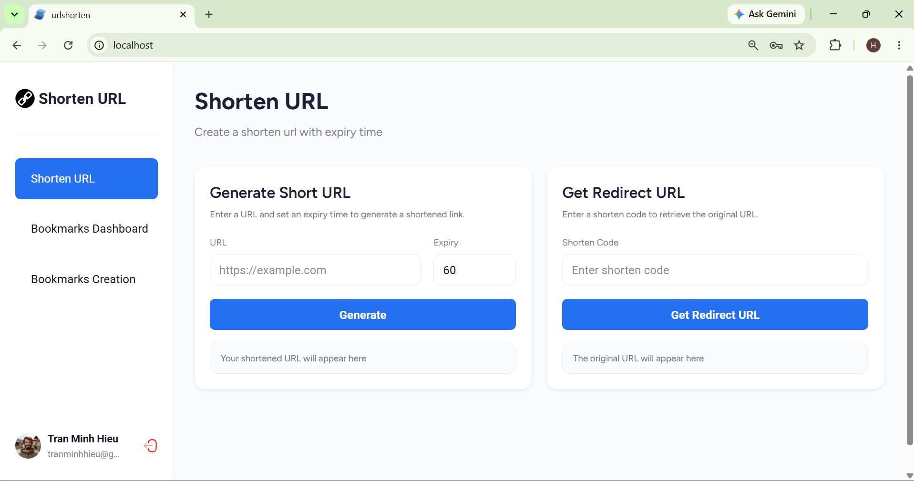

### Display user's bookmarks

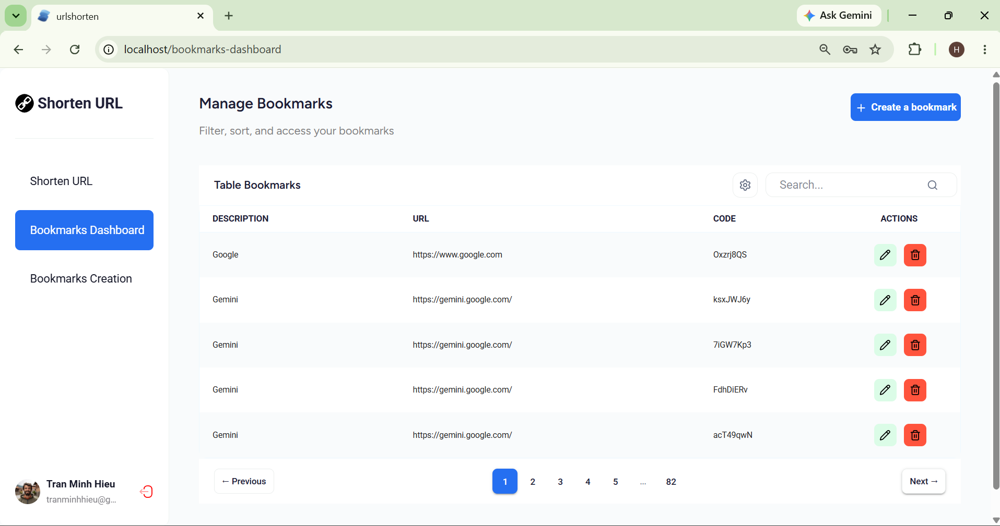

### Create a new bookmark

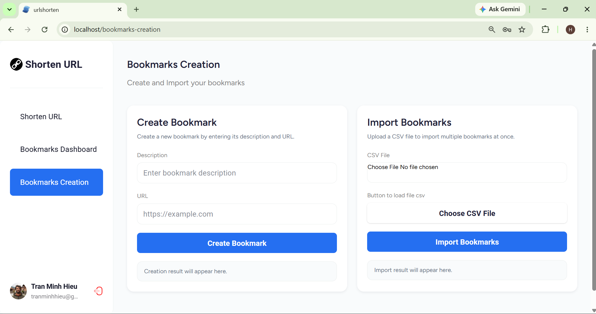

---

## Components

| Component              | Description                                                                                             |
|------------------------|---------------------------------------------------------------------------------------------------------|
| DeleteBookmarkModal    | Confirmation modal for deleting a bookmark                                                              |
| EditBookmarkModal      | Modal for editing bookmark information                                                                  |
| EditProfileModal       | Modal for updating user profile information                                                             |
| Header                 | Reusable page header with title, description, and optional CTA button                                   |
| NavItems               | Sidebar navigation with route links, current user information, profile access, and logout functionality |
| Pagination             | Pagination control for navigating between pages with previous, next, and numbered page buttons          |
| TableSettingsModal     | Modal for configuring the number of items displayed per page                                            |
| TableToolbar           | Table toolbar providing the table title, search input, and table settings control                       |

### DeleteBookmarkModal

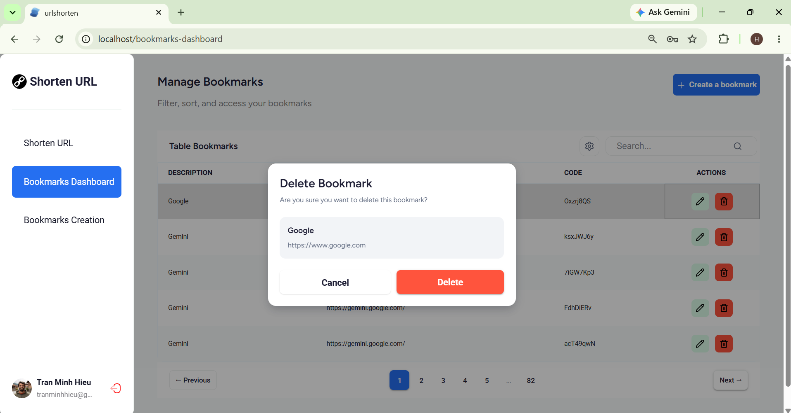

### EditBookmarkModal

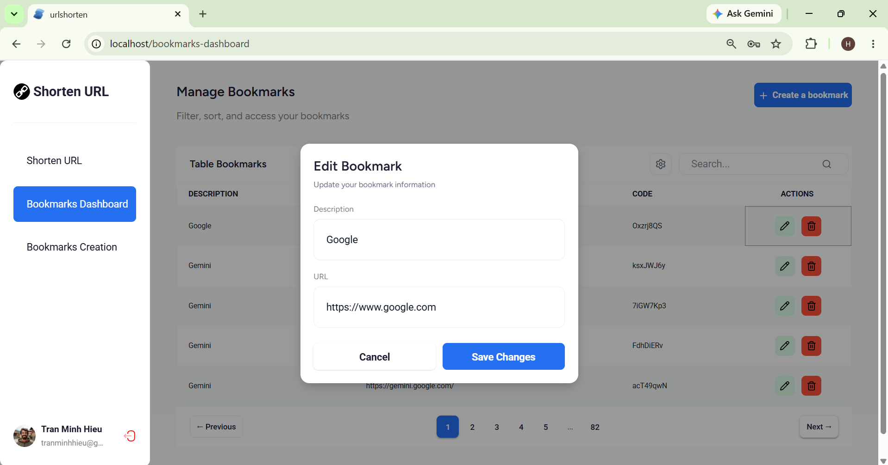

### EditProfileModal

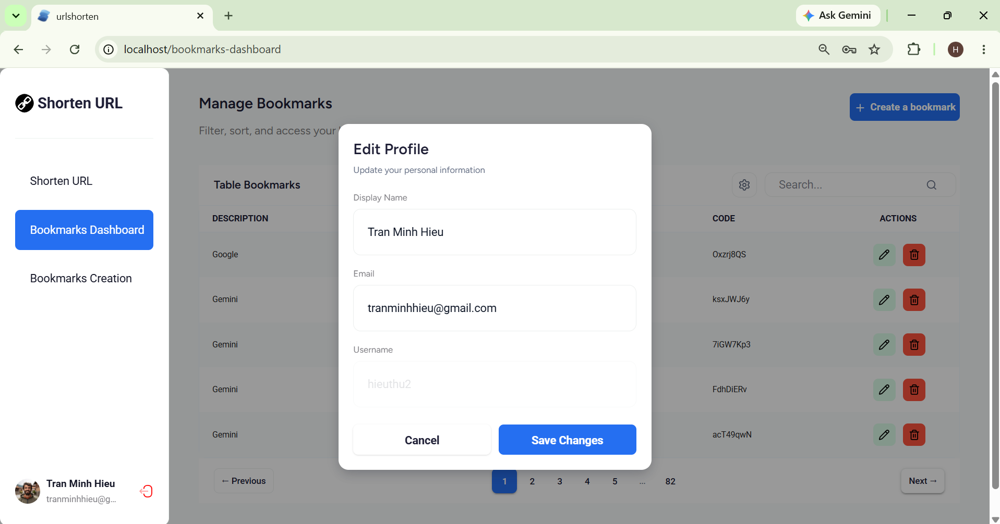

### Header

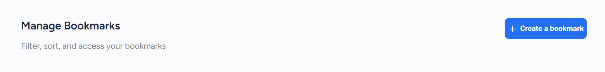

### NavItems

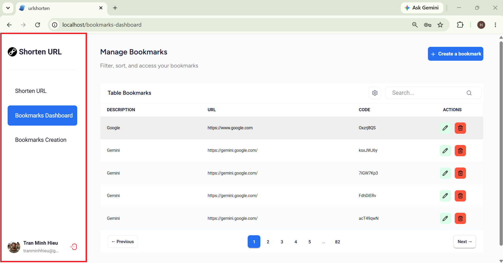

### Pagination

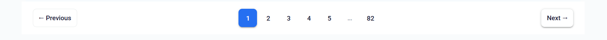

### TableSettingsModal

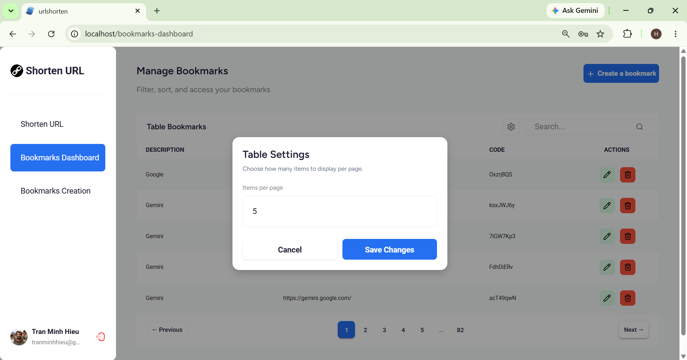

### TableToolbar

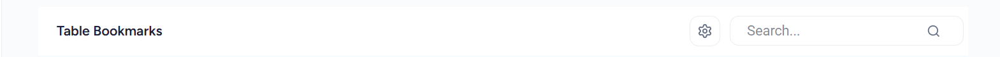

---

## Getting Started

### Prerequisites

- [React 19](https://react.dev/)
- [Node 24+](https://nodejs.org/en)
- [Docker](https://www.docker.com/) & Docker Compose
- [Make](https://www.gnu.org/software/make/)


### 1. Set up bookmark service environment variables

- [Bookmark Service Environment Setup](https://github.com/HemlockPham7/bookmark-service)

### 2. Set up user service environment variables

- [User Service Environment Setup](https://github.com/HemlockPham7/user-service)

### 3. Set up worker service environment variables

- [Worker Service Environment Setup](https://github.com/HemlockPham7/worker-service)

### 4. Set up postgres environment variables

| Variable                 | Default          | Description                                              |
|--------------------------|------------------|----------------------------------------------------------|
| `POSTGRES_USER`          | admin            | PostgreSQL username used by the database container.      |
| `POSTGRES_PASSWORD`      | admin            | PostgreSQL password used by the database container.      |
| `POSTGRES_DB`            | bookmark         | PostgreSQL database name used by the database container. |
| `TZ`                     | Asia/Ho_Chi_Minh | Application timezone.                                    |

### 5. Start infrastructure (PostgreSQL + Redis)

```bash
docker-compose up redis postgres -d
```

### 6. Start service (user-service + bookmark-service)

```bash
docker-compose up user-service bookmark-service worker-service -d
```

The API for user-service will be available at `http://localhost/api/user-service`.
Swagger user-service UI: `http://localhost/api/user-service/swagger/index.html`.

The API for bookmark-service will be available at `http://localhost/api/bookmark-service`.
Swagger bookmark-service UI: `http://localhost/api/bookmark-service/swagger/index.html#/`.

### 7. Run the frontend

```bash
docker-compose up portal -d
```

The API for user-service will be available at `http://localhost`.

### 8. Run the nginx

```bash
docker-compose up nginx -d
```

## Docker

### Build image

```bash
make docker-build
```

### Push image to Docker Hub

```bash
make docker-release
```

---

## Q&A

### Configuration environment for running on docker

```
PREFIXENV_REDIS_ADDR=redis:6379
PREFIXENV_DB_HOST=postgres
```

### Configuration environment for running on local

```
PREFIXENV_REDIS_ADDR=localhost:6379
PREFIXENV_DB_HOST=localhost
```

- And remember to download the package `godotenv` to load the environment from .env file, or else you need to add the environment variables manually.